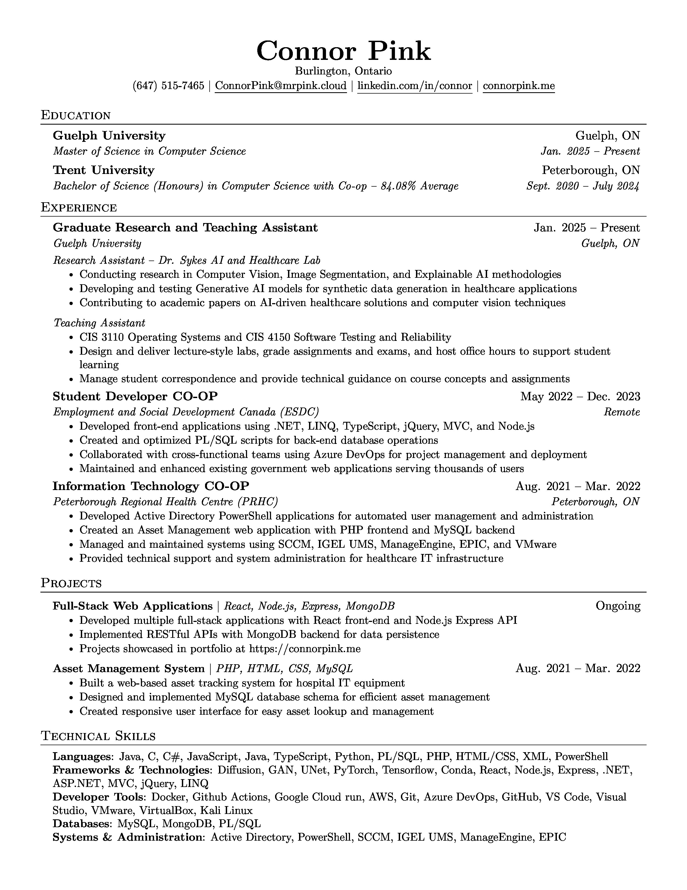

# 📄 Connor Pink - Resume

My professional resume built with LaTeX using the popular Jake's Resume template. This repository contains both the source `.tex` file and the compiled PDF, with automated builds and versioned releases.

---

## 📋 Preview

<div align="center">
  
### [📥 Download PDF](resume.pdf) | [👁️ View PDF](../../blob/main/resume.pdf) | [📦 All Releases](../../releases)

<a href="resume.pdf">
  
</a>
<a href="../../releases">
  
</a>

<br><br>



<br>

**Click on `resume.pdf` above to view the full resume in your browser**

</div>

---

## 🎓 About

**Current Position:** M.Sc. Computer Science Student & Graduate Research Assistant  
**Institution:** Guelph University  
**Research Focus:** Computer Vision, Image Segmentation, Generative AI, Synthetic Data, Explainable AI

---

## 🤖 Automated Workflow

This repository uses **GitHub Actions** to automatically build and release your resume whenever `main.tex` is updated.

### How It Works

1. **Edit** `main.tex` with your changes
2. **Commit** with an optional job tag (see below)
3. **Push** to GitHub
4. **Workflow automatically:**
   - ✅ Compiles LaTeX to PDF
   - 🖼️ Generates preview.jpg
   - 📤 Commits PDF and preview back to repo
   - 🏷️ Creates a tagged release

### Tagging Releases for Specific Jobs

When tailoring your resume for a specific position, include `[job: Company/Position]` in your commit message:

```bash
# For a specific job application
git add main.tex
git commit -m "Tailor experience section [job: Google SWE]"
git push
```

**Result:** Creates release tagged as `Google-SWE-2025.01.07-1430`

```bash
# For a different position
git commit -m "Update skills for ML role [job: Meta Research Scientist]"
git push
```

**Result:** Creates release tagged as `Meta-Research-Scientist-2025.01.07-1445`

```bash
# For general updates (no job tag)
git commit -m "Fix typo in education section"
git push
```

**Result:** Creates release tagged as `v2025.01.07-1500`

### Example Release History

Your releases page will show a complete history:

```
📦 Google-SWE-2025.01.15-0930
   Resume - Google SWE (2025.01.15-0930)

📦 Meta-Research-Scientist-2025.01.10-1445
   Resume - Meta Research Scientist (2025.01.10-1445)

📦 Microsoft-Cloud-Engineer-2025.01.08-1620
   Resume - Microsoft Cloud Engineer (2025.01.08-1620)

📦 v2025.01.07-2100
   Resume - 2025.01.07-2100 (general update)
```

### Manual Trigger (Backup Option)

If you need to create a release without pushing changes:

1. Go to **Actions** tab
2. Click **Build and Release Resume**
3. Click **Run workflow**
4. (Optional) Enter job description
5. Click **Run workflow** button

---

## 🛠️ Building from Source (Local)

### Prerequisites

- LaTeX distribution (TeX Live, MiKTeX, or MacTeX)
- Required packages: `latexsym`, `fullpage`, `titlesec`, `enumitem`, `hyperref`, `fancyhdr`, `babel`, `tabularx`

### Compilation

```bash
# Using pdflatex
pdflatex main.tex
pdflatex main.tex  # Run twice for proper formatting

# Or using latexmk (recommended)
latexmk -pdf main.tex
```

### Generate Preview Image

```bash
# Requires ImageMagick
magick convert -density 300 resume.pdf[0] -quality 90 preview.jpg
```

### Quick Compilation Scripts

**Linux/macOS:**

```bash
#!/bin/bash
pdflatex main.tex && pdflatex main.tex
magick convert -density 300 resume.pdf[0] -quality 90 preview.jpg
```

**Windows (PowerShell):**

```powershell
pdflatex main.tex; pdflatex main.tex
magick convert -density 300 resume.pdf[0] -quality 90 preview.jpg
```

---

## 📁 Repository Structure

```
.
├── .github/
│   └── workflows/
│       └── build-resume.yml    # Automated build & release workflow
├── main.tex                     # LaTeX source file (edit this)
├── resume.pdf                     # Compiled resume PDF (auto-generated)
├── preview.jpg                  # Resume preview image (auto-generated)
└── README.md                    # This file
```

**Note:** Files marked as "auto-generated" are created by the GitHub Actions workflow and shouldn't be manually edited.

---

## 💡 Workflow Tips

### Best Practices

1. **Always tag job-specific versions** - Use `[job: Company Position]` to track applications
2. **Use descriptive commit messages** - Makes your git history more useful
3. **Check releases before applying** - Verify the PDF looks correct
4. **Download from releases** - For applications, download from the Releases page to ensure you have the exact version

### Commit Message Examples

```bash
# ✅ Good - Tagged for specific job
git commit -m "Highlight ML experience [job: OpenAI Research Engineer]"

# ✅ Good - General improvement
git commit -m "Update contact information and add new project"

# ✅ Good - Multiple changes with job tag
git commit -m "Restructure experience section and update skills [job: Amazon SDE]"

# ⚠️ Okay - Works but no job tracking
git commit -m "Update resume"
```

### Tracking Your Applications

Each release with a job tag creates a permanent record:

- 📅 **Timestamp** - When you applied
- 📝 **Commit SHA** - Exact code version
- 📄 **PDF Archive** - The exact resume you sent
- 🖼️ **Preview** - Quick visual reference

---

## 🎨 Template Credit

This resume is based on the **Jake's Resume** template, a clean and professional single-page resume format popular in the tech industry.

- **Template:** [Jake's Resume](https://www.overleaf.com/latex/templates/jakes-resume/syzfjbzwjncs)
- **License:** MIT

---

## 📞 Contact

**Connor Pink**

- 📧 Email: ConnorPink@mrpink.cloud
- 🌐 Portfolio: [connorpink.me](https://connorpink.me)
- 📍 Location: Burlington, Ontario, Canada

---

## 📝 License

This resume content is © Connor Pink. The LaTeX template is licensed under MIT by Jake Gutierrez.

---

<div align="center">

**Last Updated:** January 2025

Made with ❤️ and LaTeX | Automated with GitHub Actions

</div>
